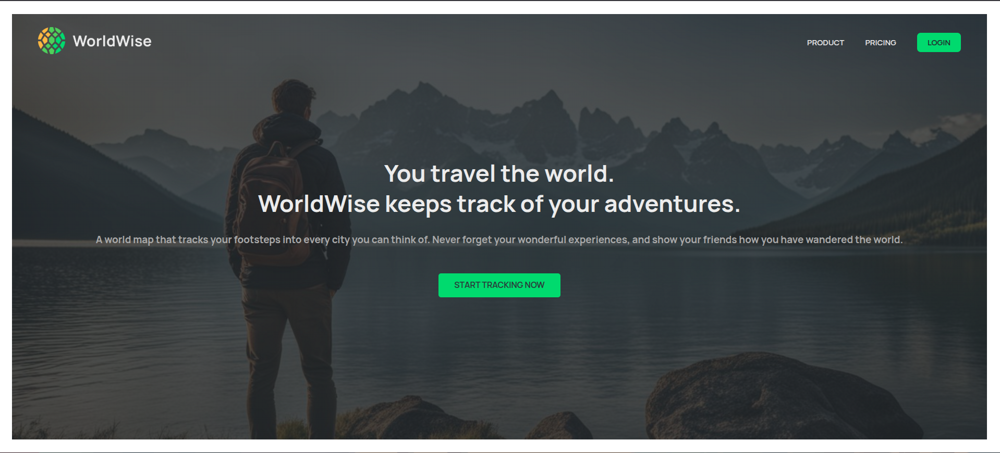
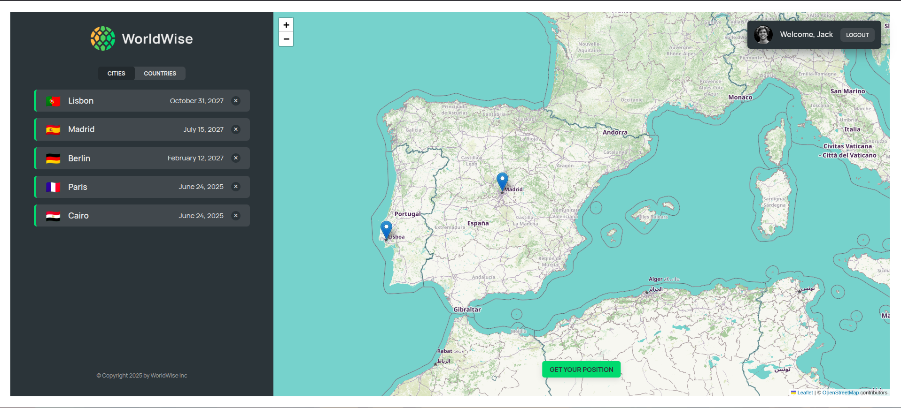
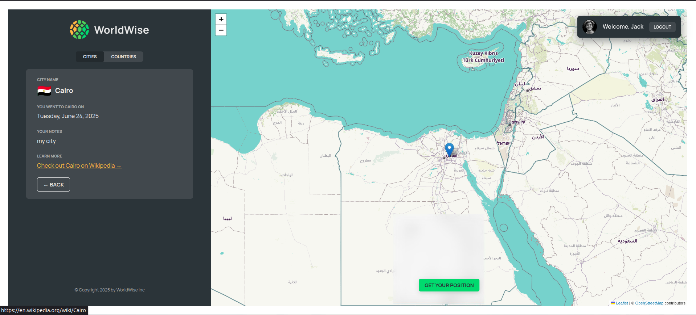
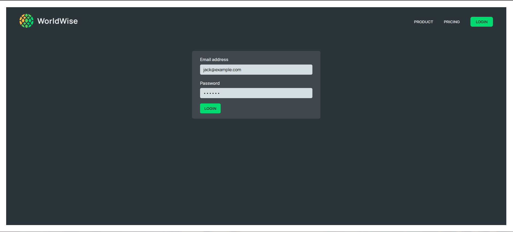

# WorldWise 🌍

WorldWise is a modern React application that helps you track your travels and adventures around the world. Mark cities you've visited, add notes, and visualize your journey on an interactive map.

---

## ✨ Features

- **Responsive Design:**  
  Clean, modern UI that works on desktop and mobile.  

  

- **Interactive Map:**  
  Visualize all your visited cities on a beautiful map powered by [Leaflet](https://leafletjs.com/).

- **Country Overview:**  
  See a summary of countries you've visited, grouped by country. 

  
 
- **City Management:**  
  Add, view, and delete cities. Each city includes country, emoji, date of visit, and personal notes.  
  
  


- **Authentication:**  
  Simple login/logout flow with protected routes.
  
  


- **Persistent Data:**  
  All city data is stored and served via a local JSON server.

---

## 🛠️ Technologies Used

- **React 18** with functional components and hooks
- **React Router v6** for client-side routing
- **React Context & Reducer** for state management
- **Leaflet & React-Leaflet** for interactive maps
- **Vite** for fast development and build
- **CSS Modules** for scoped, maintainable styles
- **json-server** for local REST API
- **ESLint** for code quality

---

## 🚀 Getting Started

1. **Install dependencies:**
   ```sh
   npm install
   ```

2. **Start the local API server:**
   ```sh
   npm run server
   ```
   This runs `json-server` at [http://localhost:8000](http://localhost:8000).

3. **Start the development server:**
   ```sh
   npm run dev
   ```
   The app will be available at [http://localhost:5173](http://localhost:5173).

---

## 📂 Project Structure

```
src/
  components/      # Reusable UI components
  contexts/        # React Context providers
  hooks/           # Custom React hooks
  pages/           # Page components and Photos
    Photos/        # App screenshots
  assets/          # Static assets
public/            # Public images and icons
data/              # JSON data for json-server
```

---

## Credits

- Map tiles by [OpenStreetMap](https://www.openstreetmap.org/)
- Map rendering by [Leaflet](https://leafletjs.com/)
- UI inspired by modern travel apps

---

## 📄 License

This project is for educational purposes.

---

> Made with ❤️
